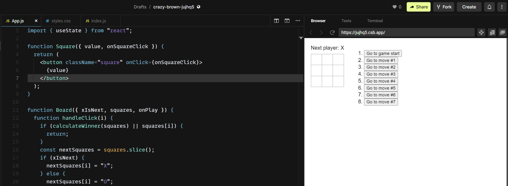

# React tic-tac-toe tutorial game

## Description

This repository containts the finished code after following the React tutorial from https://beta.reactjs.org/learn/tutorial-tic-tac-toe site.

The aim of this was for me to get more familiar with React and solidify concepts that I have learned from other tutorials, thus helping me with my current project that I am working on right now.

Because this is a tutorial project, I have not put emphasis on deploying/publishing the completed game because I was using codesandbox.io website to follow the tutorial rather than my local environment.

If you wish to have a quick game, you can use this sandbox I was working on: https://codesandbox.io/s/crazy-brown-jujhq5?file=/App.js

